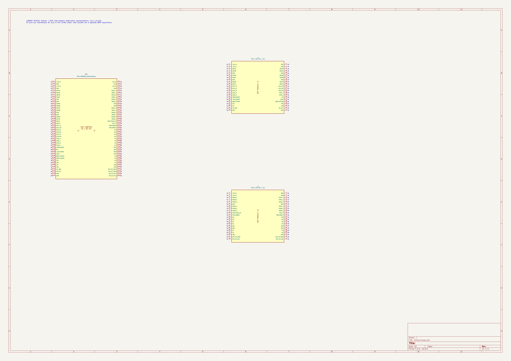
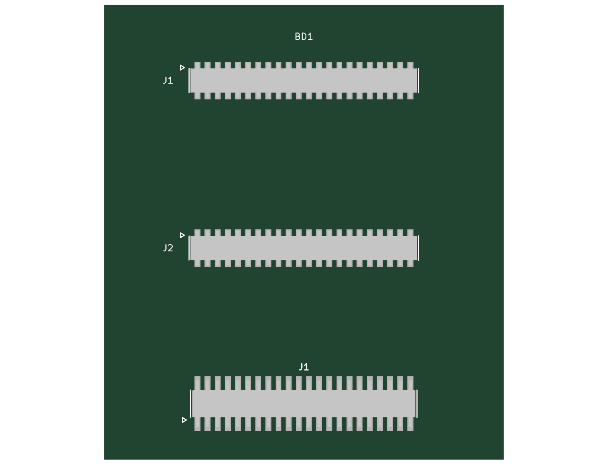
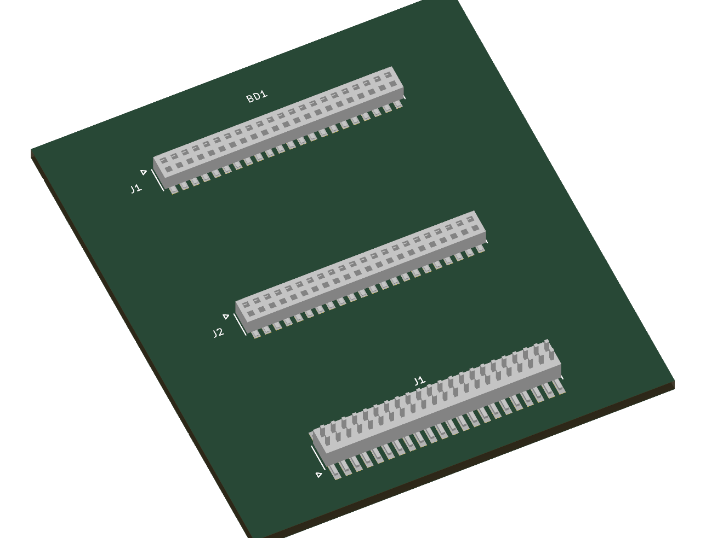

# WiPowerOne DSP 모듈 라이브러리

기존 WiPowerOne 보드 카테고리 `WPO_Board`에 공용 등록했다. 기존 11개 심볼은 보존했다. `${KICAD_GITHUB}` 기반 전역 심볼/풋프린트 등록을 완료했으며 열려 있는 선택창은 새로 열어 검색한다.

## 사용 대상
| 심볼 | 용도 | 풋프린트 |
|---|---|---|
| WPO_Board:DSP_F28P550_40x30_Module | 외부 보드에서 DSP 모듈 전체를 단일 BD 부품으로 표시 | WPO_Board:DSP_F28P550_40x30_SocketPair |
| WPO_Board:DSP_F28P550_40x30_Header_J1 | DSP 보드 측 수헤더 J1, 실제 신호명 포함 | dsp_connectors:FTSH-122-03-L-DV |
| WPO_Board:DSP_F28P550_40x30_Header_J2 | DSP 보드 측 수헤더 J2, 실제 신호명 포함 | dsp_connectors:FTSH-122-03-L-DV |

모듈 심볼은 하나의 유닛이며 88핀을 모두 노출한다. `J1_1`은 기존 J1의 1번, `J2_1`은 기존 J2의 1번이다. 헤더 심볼은 각 1~44번을 유지한다. 외부 보드에는 모듈 또는 기존 개별 소켓 방식 중 하나를 선택한다. 두 표현을 동시에 같은 소켓 위치에 배치하면 중복된다. 헤더 심볼은 DSP PCB 측 부품이며 외부 보드 측 암소켓과 구분한다. 모든 사용 핀은 passive로 모델링하여 이 라이브러리만으로 전기적 방향/전압 검사가 보장되지는 않는다. NC 핀은 연결하지 않는다.

## 장착 방향
모듈을 위에서 보는 기준으로, DSP 수헤더는 B.Cu/0도이며 중심은 (120,104.5), (120,125.5) mm이다. 모듈 장착 풋프린트는 외부 보드 F.Cu/0도로 배치하며 내부 암소켓은 각각 180도이다. 자동으로 뒤집지 않는다. 원점은 모듈 중심, 소켓 중심은 (0,-10.5)/(0,+10.5) mm, 간격 21 mm이다. 접점 피치는 1.27 mm이고 각각 2×22핀이다.

외곽 40×30 mm는 Fab/Dwgs.User 참고선이며 Edge.Cuts가 아니다. Courtyard는 외곽보다 0.5 mm 크다. 부품 하부 공간을 안전한 빈 공간으로 가정하지 않는다. 모듈 하부 실장 부품, 고정 구조, 높이와 간섭은 추가 검토가 필요하다. 현재 DSP PCB 배선은 미완료이므로 핀맵이나 배치 개정 시 호환성 재검토가 필요하다.

## BOM 및 실장
단일 심볼의 BOM 항목은 DSP 모듈 어셈블리 한 개이다. 모듈 주문 PartNumber, Datasheet, Cost는 아직 미정으로 빈 값이다. Manufacturer는 기존 사내 보드 관리명 WiPowerOne을 적용했다. 모듈 실장에 필요한 **Samtec CLP-122-02-L-D 소켓 2개는 별도로 BOM에 추가**해야 한다. 실제 DSP 수헤더는 FTSH-122-03-L-DV이며 헤더 비용도 미정이다.

복합 풋프린트의 중심을 하나의 소켓 실장 위치로 오인하지 않도록 위치 파일 출력에서 제외했다. 자동 실장 시 `socket_bom.json`의 상대 위치를 최종 보드의 이동·회전에 맞게 변환해 소켓 2개의 실제 위치를 출력한다. 자동화된 별도 BOM 처리를 원하지 않으면 이전 개별 소켓 템플릿을 사용한다.

전원 입력은 5 V, 디지털은 3.3 V, ADC 입력은 0~3.0 V이다. +3V3_SENSE는 고임피던스 감시용이고 외부 전원 공급 출력이 아니다. CAN_H/L은 트랜시버를 지난 버스 신호이다.

## 검증과 한계
- 최신 DSP 네이티브 넷리스트를 기준으로 모듈 88핀, 헤더 44핀×2의 신호명 및 핀/패드 176개 대응을 확인했다.
- 3개 심볼의 필수 8필드, 총 24개 필드와 표시 설정을 확인했다.
- `python -m kicad_toolkit validate` 신규 심볼 3개 및 풋프린트 1개 통과. 등록본을 참조하는 검토 회로의 `kicad-cli sch erc` 오류 0, 경고 0. 이 검토 회로는 핀을 의도적으로 미접속 표시한 라이브러리 검토용이며 완성 시스템 ERC 결과가 아니다.
- `python -m kicad_toolkit audit --category WPO_Board`: 14/14 심볼 필드 통과, 손상 파일 0, 끊어진 3D 0. 기존 DRV_Board/DSP_Board/GAPowerBoard/VAControlBoard/VAPowerBoard의 풋프린트 값 `-` 때문에 끊어진 참조 5개가 남아 카테고리 전체 audit는 실패 상태이다. 이번 신규 3개와는 별개이며 기존 심볼은 수정하지 않았다.
- 기존 공용 소켓/헤더 STEP은 도면 기반 간략 형상이다. 복합 풋프린트의 두 소켓은 동일 공용 모델을 위치 이동·회전하여 재사용한다. 이는 어셈블리 내 두 부품의 실제 배치 변환이며 모델 원점 보정은 아니다. **DSP 보드 전체 어셈블리 STEP은 포함하지 않는다.**
- 네이티브 KiCad 상면/등각 렌더에서 패드, 모델 방향 및 착좌 상태를 확인했다. 자동 검사/렌더를 제조·EMC·기계 간섭 검증 완료로 해석하지 않는다.

