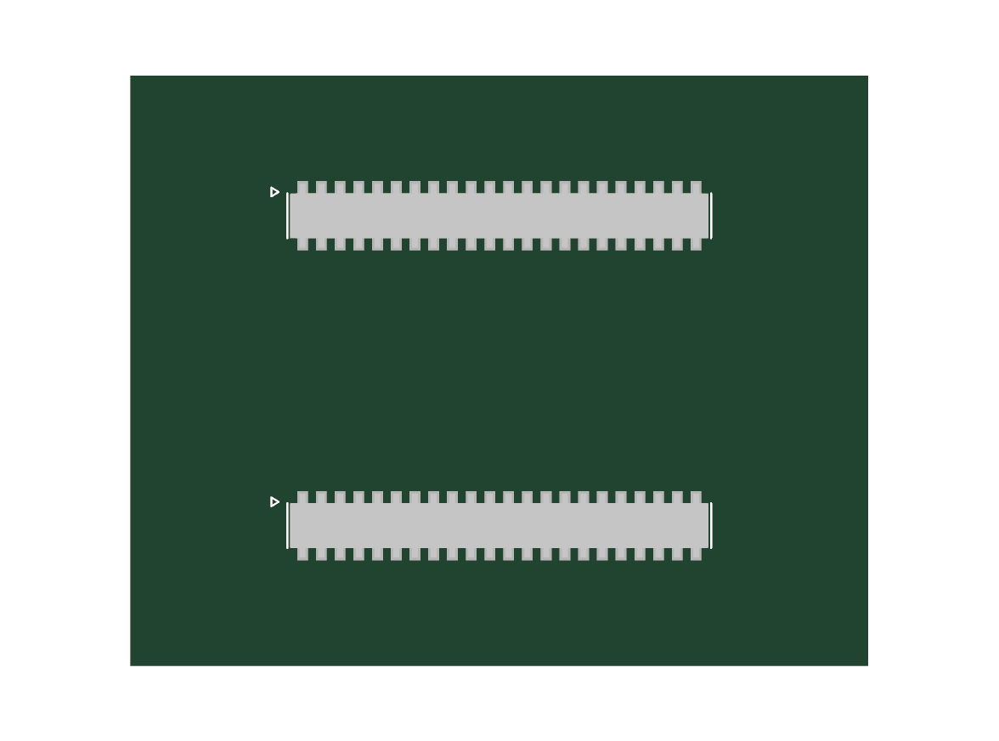
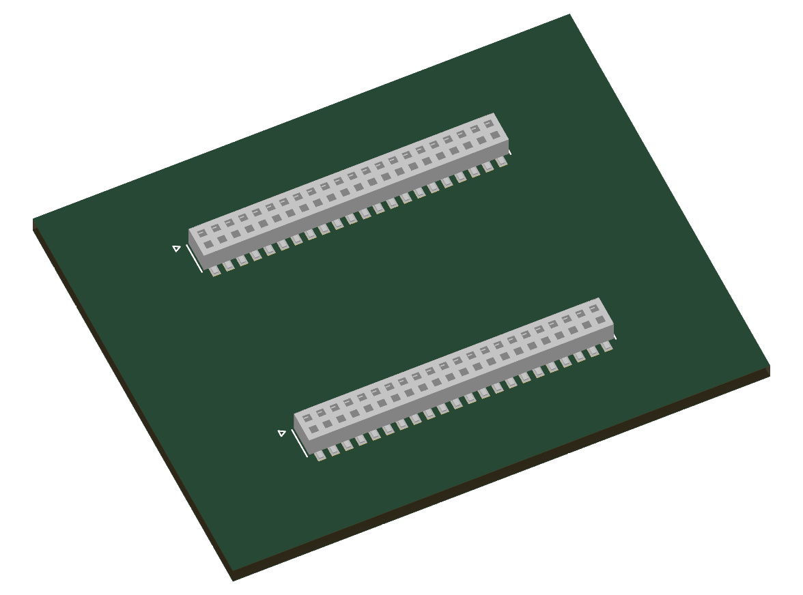

# DSP 모듈 장착 인터페이스 등록 / 2026-09-28

공용 심볼 module_interfaces:DSP_F28P550_40x30_J1 및 J2를 함께 사용한다. 실제 구매 부품은 Samtec CLP-122-02-L-D 소켓 2개이며 가격은 미정이다. 기존 공용 풋프린트와 간략 STEP 모델을 참조한다.

PCB 템플릿의 소켓 2개와 모듈 외곽은 그룹 및 잠금 상태이다. 그룹 전체를 이동하며 소켓 간격 21 mm와 회전 180도를 유지한다. 모듈 외곽 40×30 mm는 Dwgs.User 참고선이다. 회로도 재번호 지정 후 PCB 심볼 대응을 확인한다. 다른 시트에 통합할 때 로컬 라벨은 자동으로 상위 시트와 연결되지 않으므로 계층 포트 또는 의도한 배선 연결을 추가한다.

## 검증
- 현 DSP 네이티브 넷리스트와 88개 핀 대응 확인.
- 심볼 핀과 풋프린트 패드 88개 대응 확인; 필수 필드 16개 확인.
- 공용 등록본 심볼 검증 2개 통과, 기구 외곽 풋프린트 검증 1개 통과.
- 기구 외곽의 패드/3D 없음 경고는 의도한 구조이다.
- 등록본 네이티브 ERC 오류 0개. 외부 회로가 아직 연결되지 않은 템플릿 특성상 isolated_pin_label 경고 61개가 있다.
- 최종 PDF 가독성 확인. 아래 KiCad 네이티브 렌더에서 소켓 방향과 모델 표시 확인.
- 검증 도중 제한된 실행 환경의 CLI 시간 초과가 있었으며, 지침에 따른 사용자 설정 접근 권한으로 재검증하여 통과했다.

## 남은 시스템 검토
현재 DSP의 배선은 미완료이며 커넥터 위치나 핀맵 변경 시 이 인터페이스의 호환성을 다시 확인해야 한다. 모듈 하부 부품 간섭, 스페이서 높이 및 기계적 고정은 실제 장착 보드에서 검토해야 한다. STEP은 제조사 원본 CAD가 아닌 간략 형상이다.

